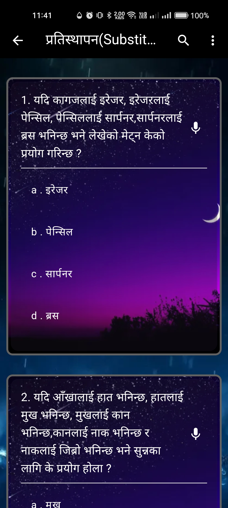

# 📚 Loksewa MCQ App

An interactive Flutter-based Android application designed to help users prepare for Nepal's Loksewa exams. The app features General Knowledge (GK) and Intelligence Quotient (IQ) Multiple Choice Questions (MCQs) categorized for better learning. Built using Firebase for backend functionalities.

## 🚀 Features

- 🔐 **Authentication**: Login & Signup functionality with Firebase.
- 📂 **Categorized MCQs**: View questions based on different categories.
- 🎛 **Admin Panel**: Add and update questions dynamically.
- 🌄 **Dynamic Backgrounds**: Unique background images on every screen.
- 📊 **Progress Tracking** (Upcoming Feature): Keep track of learning progress.
- 🏆 **Leaderboard & Challenges** (Upcoming Feature): Compete with other learners.

## This project is discontinued due to lack of human resource to add questions of mcq of differnt loksewa fields.


## 🎥 Demo Video

Click the below thumbnail to watch the video

[](readme_assets/15.mp4)


## 📸 Screenshots

This are some screenshots of the app





## 🛠 Tech Stack

- **Flutter** - Cross-platform UI framework
- **Firebase** - Backend & Authentication
- **Dart** - Programming Language

## 📥 Installation

1. Clone the repository:
   ```bash
   git clone https://github.com/your-username/loksewa-mcq-app.git
   ```
2. Navigate to the project directory:
   ```bash
   cd loksewa-app
   ```
3. Install dependencies:
   ```bash
   flutter pub get
   ```
4. Run the app:
   ```bash
   flutter run
   ```


## 📜 License

This project is not licensed and anyone can use this as they like.
---

📩 Feel free to reach out if you have any questions or suggestions!
